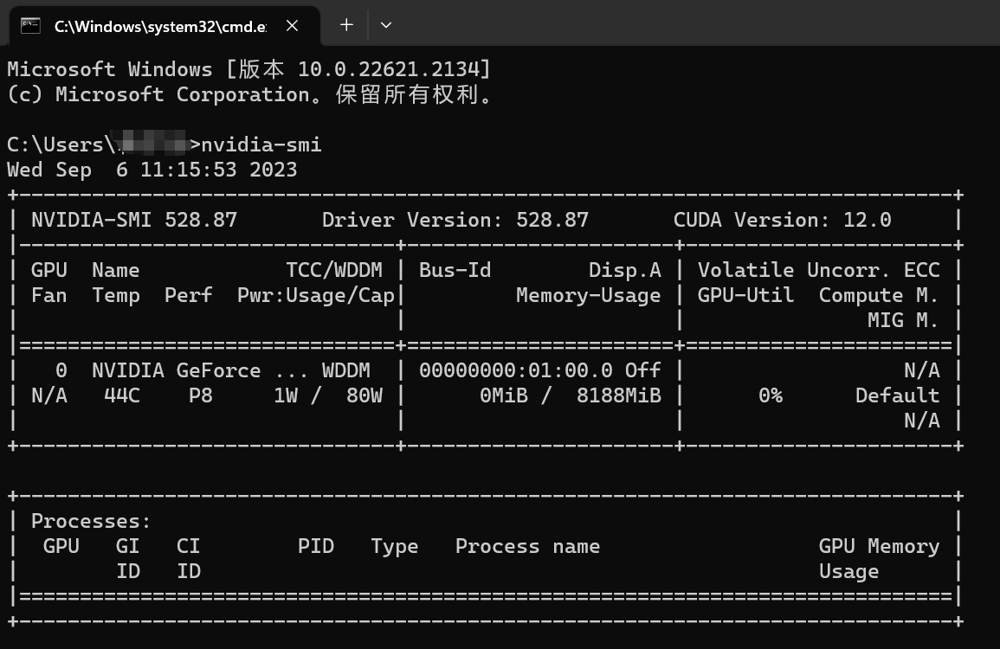

# FZU-FYP-VehicleReID

<a href='https://drive.google.com/file/d/1jbUqSOgpFriuA3PUO2qAShqfJPhx5nD1/view?usp=drive_link'></a> 
<a href='https://huggingface.co/spaces/Vision-CAIR/minigpt4'></a> 
[](https://www.youtube.com/watch?v=__tftoxpBAw&feature=youtu.be)

## News
Source code is coming soon...


## Website Preview
### Home Page


### Heroku Link
Please check the WebApp through: [Link](http://itlab.fzu.edu.cn/gzl/ZhuanJi/TeacherInfo2.aspx?No=T96022)

## Programming Environment
### CUDA Version


### IDE
PyCharm Community Edition 2022.3.2

### Packages Version
torch==2.0.0  
streamlit==1.11.0  
altair==4.2.2  
opencv-python==4.7.0.68  
pip install --upgrade charset-normalizer  
scipy==1.10.1    
matplotlib==3.7.2  
psutil==5.9.5  
seaborn==0.12.2  
pyyaml

## Installation

```
conda env create -f environment.yml
conda activate fyp
```

## Acknowledgement
I do appreciate the guidance and help given to my project by [Prof. Liqin Huang](http://itlab.fzu.edu.cn/gzl/ZhuanJi/TeacherInfo2.aspx?No=T96022).
