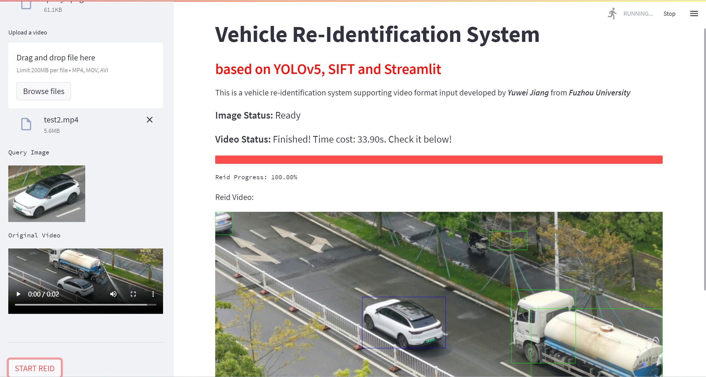
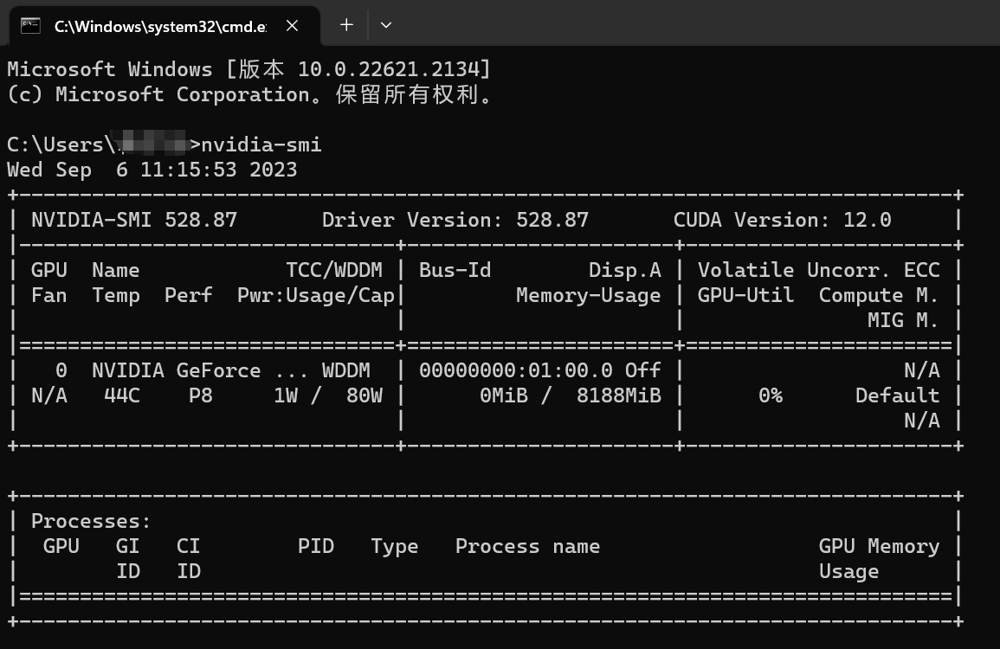

# FZU-FYP-VehicleReID

## Acknowledgement
I do appreciate the guidance and help given to my project by [Prof. Liqin Huang](http://itlab.fzu.edu.cn/gzl/ZhuanJi/TeacherInfo2.aspx?No=T96022).

## Website Preview
### Home Page

## Programming Environment
### CUDA Version

### IDE
PyCharm Community Edition 2022.3.2

### Packages Version
torch==2.0.0  
streamlit==1.11.0  
altair==4.2.2  
opencv-python==4.7.0.68  
pip install --upgrade charset-normalizer  
scipy==1.10.1    
matplotlib==3.7.2  
psutil==5.9.5  
seaborn==0.12.2  
pyyaml

## Project Report
Here is my FYP-Report.

## News
**[News]** Source code is coming soon...
